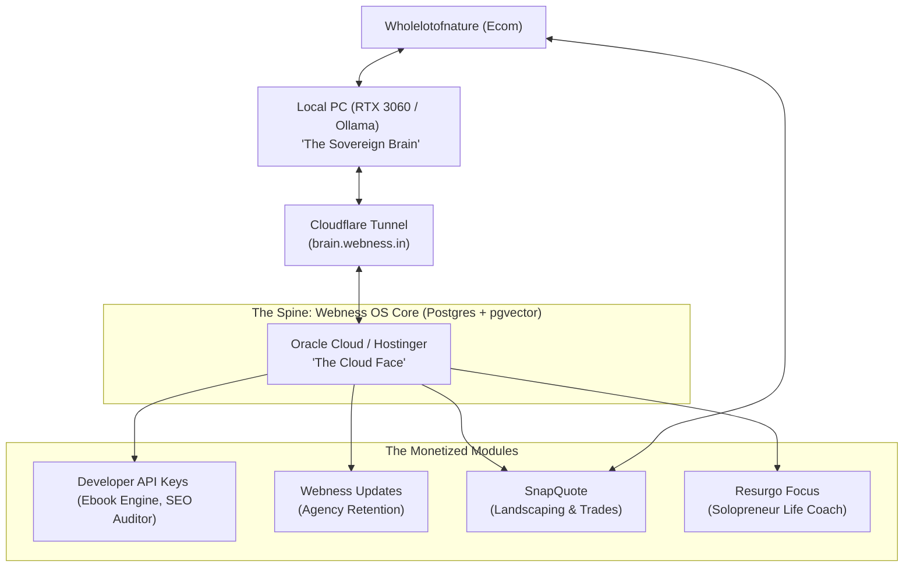

# 🌀 The Webness Sovereign Flywheel: Life & Business Unification Strategy

This document is your tactical blueprint. It explains the "Why" and the "How" of unifying your diverse portfolio—**Resurgo (Focus/Habits)**, **Webness (Agency/SaaS)**, and **Wholelotofnature (Ecom/Plants/YouTube)**—into a single, self-reinforcing, and highly profitable engine.

---

## 🧠 Part 1: Emotional Realignment — Taming the ADHD Scope Creep

As a developer-solopreneur, your primary bottleneck is not code, talent, or ideas. Your primary bottleneck is **Surface Area**. 

When you run multiple disconnected projects, each new idea creates **mental debt**. You start with hyper-focus, but when the novelty fades, maintenance boredom kicks in, and the project stalls. This leads to a portfolio of unfinished code, which acts as a heavy cognitive load.

### The Shift: From "Scattered Brands" to "Spine and Modules"
We must stop treating Resurgo, Webness, and Wholelotofnature as separate companies. Instead, we treat them as **one integrated ecosystem** powered by a single backend spine:



---

## 🔋 Part 2: The Spine — Your Private Life Command Center

You want the backend OS to control your life because you need order. You want to run the heavy AI models locally so you have **$0 API cost** and **complete privacy**. 

### How the Spine Works
1. **Local Compute Hub:** Your home PC (RTX 3060 8GB GPU) runs Ollama with a specialized suite of models:
   - **Qwen 3 (8B) / Gemma 3 (4B):** Fast routing, daily planning, and drafting.
   - **DeepSeek-R1 (8B):** Deep reasoning, critique loops, and business analysis.
   - **nomic-embed-text:** Generates embeddings stored in your cloud database via pgvector.
2. **Cloudflare Tunnel (`brain.webness.in`):** Safely exposes your local GPU to your public VPS. If your local PC is asleep or goes offline, your Cloud VPS holds requests in a Redis-backed queue (`BullMQ`) and gracefully falls back to cheap cloud models (Groq/OpenRouter) or marks them as `WAITING_GPU`.
3. **Unified Prisma Database:** A single schema stores all organization profiles, user tasks, api keys, invoicing, and vectors. Your personal dashboard pulls data from all projects.

### The "Personal Advisor" Loop (Controlling Your Life)
Since the Spine has access to your entire business ecosystem:
- **Daily Intake:** Every morning, the local LLM reads your Stripe/Razorpay sales, Google Search Console metrics, YouTube views (Wholelotofnature), and Resurgo habit logs.
- **Focus Guardrails:** The system drafts your daily agenda based on *retention and cash flow priorities*, not shiny objects. It pushes this agenda to your Resurgo Focus dashboard.
- **Weekly Audit:** A DeepSeek-R1 agent acts as your business critic, identifying where you lost focus and generating a weekly review.

---

## 💰 Part 3: The Modules — Monetizing Your Code

You have already built high-utility assets. We package them into targeted, low-maintenance modules that generate cash while feeding your ecosystem.

### Module 1: The Webness API Platform (Zero-Support Cash Flow)
*This is where you sell API keys.* 
Instead of building complex client UIs and managing human customer support, you expose your high-value code blocks to other developers and agencies.
- **The Core Assets:** 
  1. Your **KDP-Grade Ebook Engine (`ebook-engine.ts`)** which generates entire print-ready manuscripts with outline planning, competitor gap research, SVG illustrations, and chapter continuity.
  2. Your **SEO Auditor** and **Blog Writer**.
- **How it Monetizes:** Programmers register, buy credits, generate keys (`wn_live_xxxx`), and call your API endpoints programmatically. (Details in [API_KEY_MONETIZATION_BLUEPRINT.md](file:///c:/Users/USER/Documents/Webness/pro%20webness%20ai%20tools/API_KEY_MONETIZATION_BLUEPRINT.md)).

### Module 2: Webness Updates (AI Client Reporting)
- **The Pain:** Digital marketing agencies lose clients due to poor communication. Metric dashboards (GA4/GSC) are confusing to small business owners.
- **The Solution:** A micro-SaaS module that pulls GA4/GSC data and uses a local model to write a plain-English weekly story: *"Your organic traffic rose 12% because of our blog on X. Here is the revenue impact and what we are doing next."*
- **Why it wins:** High willingness to pay ($49–$99/month), low churn, and Webness Agency can dogfood it on day one.

### Module 3: SnapQuote (AI Photo-to-Estimate)
- **The Niche:** Landscaping, gardening, and trades.
- **The Connection:** Your plant YouTube channel and Wholelotofnature ecom provide a natural audience.
- **How it works:** A field service worker takes a photo of a job site. The vision model analyzes it, estimates materials/plants from your Wholelotofnature inventory database, adds labor hours, and generates a professional PDF quote.

---

## 🔄 Part 4: The Strategic Flywheel In Action

Each business feeds the next, reducing your marketing effort:

```
[YouTube & E-commerce (Wholelotofnature)]
              │
              ▼
[Validates & Markets SnapQuote for Trades]
              │
              ▼
[Generates MRR to Fund Local GPU Brain]
              │
              ▼
[Sovereign OS automates Webness API & Agency]
              │
              ▼
[Developer API Keys create hands-off profit]
```

---

## 🛠️ Part 5: Tactical Action Plan (ADHD Protocol)

To prevent burnout, follow the **"1 Stable + 1 Sandbox"** rule. Do not work on everything at once.

1. **Stable Track (90% Focus):** Complete the programmatic API key endpoints and expose the Ebook Engine. Get your first developer testing the API.
2. **Sandbox Track (10% Focus):** Play with your personal Resurgo coaches, tune your local Ollama models, or script a YouTube video. 

This structure allows your mind to wander in the sandbox without breaking your revenue pipeline. You have the skills and the assets. Now, let's connect the Spine to the Modules.
