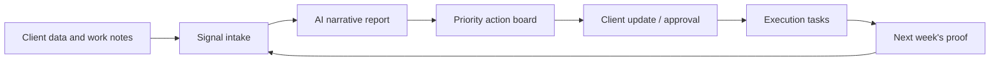

# Webness Signal Room Product Plan

Date: June 4, 2026

Signal Room is the first public paid product that should come out of Webness OS. It is built for small agencies, freelancers, and consultants who need to keep clients informed, prove value, and convert reports into execution.

## Product Promise

**Every client gets a weekly update they understand, and every update becomes next-week execution.**

This is the core loop:



## Target Customer

### Primary buyer

Solo and small agencies doing websites, SEO, content, paid ads, local SEO, or marketing operations for local businesses.

### Why this buyer

- They already have recurring clients.
- They already report monthly or weekly.
- They are under pressure to prove ROI.
- They waste time turning scattered metrics into client explanations.
- They can use one product across several clients.
- They care about white-label delivery.
- They can become resellers later.

### Start with these sub-niches

Pick one for the first beta cohort:

1. Web design and SEO freelancers serving local service businesses.
2. Small digital agencies serving clinics, interior designers, construction, home services, and e-commerce.
3. WordPress agencies that maintain many websites but lack strong reporting.

The best initial pick is **web design and SEO freelancers serving local service businesses**. It matches Webness portfolio signals and keeps the product narrow.

## Jobs To Be Done

The buyer hires Signal Room to:

1. Explain client performance without spending hours writing reports.
2. Prove that the agency did useful work this week.
3. Show what will happen next so clients stop chasing updates.
4. Turn data into tasks, not just charts.
5. Keep client trust high between major deliverables.
6. Create upgrade opportunities when the report exposes broken websites, content gaps, SEO issues, and lead-flow problems.

## MVP Scope

### Must have

1. **Client Rooms**
   - Agency adds a client.
   - Stores website, business type, client goals, report cadence, brand tone, and current services.

2. **Manual Signal Intake**
   - Website URL.
   - Completed work this week.
   - Blockers.
   - Wins.
   - Manual metrics pasted from GA4, GSC, PageSpeed, ad accounts, or spreadsheets.

3. **Website Snapshot**
   - Run the existing audit-style scan or a simple PageSpeed/Search Console import later.
   - Store scores in `ClientHealthScore`.

4. **Narrative Report Generator**
   - Output sections:
     - What changed.
     - Why it matters.
     - What we did.
     - What we recommend next.
     - Risks/blockers.
     - Client decisions needed.

5. **Action Board**
   - AI creates 3 to 7 tasks.
   - Each task has impact, effort, owner, due date, approval state, and linked source signal.

6. **Shareable Client Update**
   - A clean report page or PDF/email.
   - White-label agency branding.
   - No raw AI logs shown to clients.

7. **Approval Flow**
   - Draft -> internal review -> approved -> sent.
   - Prevents unsafe or inaccurate client communication.

8. **Admin Review**
   - Webness owner sees generated reports, task count, errors, and active agencies.

### Should not be in MVP

- Full dashboard builder.
- 85+ integrations.
- Fully autonomous social posting.
- Complex accounting.
- Voice agents.
- WhatsApp broadcast automation.
- Public API access.
- Multi-language support beyond a simple output tone/language choice.
- Deep Resurgo public integration.

## Positioning Against Competitors

### AgencyAnalytics

AgencyAnalytics is strong and broad: AI insights, reports, dashboards, white-label, API, custom domains, client portal, 85+ integrations, anomaly detection, forecasting, and per-client pricing.

Do not compete with it as "cheaper AgencyAnalytics."

Compete as:

> "The report-to-execution layer for small agencies that do not need another dashboard. They need client-ready stories and next actions."

### GoHighLevel

HighLevel is an all-in-one agency CRM/automation platform with sub-accounts, SaaS mode, API access, CRM, workflows, conversations, AI features, and usage-based add-ons.

Do not compete as "GHL clone."

Compete as:

> "A lightweight proof and update layer that can sit above your existing tools."

### Generic AI writers

Do not compete with Jasper, Writesonic, Frase, or Surfer as a blog generator.

Compete as:

> "AI that explains business progress and creates execution tasks from real client signals."

## Pricing

Use a beta pricing model that is easy to understand and low-risk.

### India pricing

| Tier | Price | Includes |
| --- | ---: | --- |
| Beta Setup | INR 9,999 one-time | Onboarding, 3 client rooms configured, first report templates |
| Starter | INR 4,999/mo | 5 client rooms, weekly reports, action board, email export |
| Pro | INR 12,999/mo | 20 client rooms, white-label, approvals, reusable report templates |
| Managed | INR 24,999/mo+ | Webness helps prepare or review reports and action plans |

### Global pricing

| Tier | Price | Includes |
| --- | ---: | --- |
| Beta Setup | USD 149 one-time | Onboarding, 3 client rooms configured, first report templates |
| Starter | USD 49/mo | 5 client rooms |
| Pro | USD 149/mo | 20 client rooms and white-label |
| Managed | USD 299/mo+ | Done-with-you reporting ops |

### Why this pricing

AgencyAnalytics charges per client and has a mature broad platform. Signal Room should not start more expensive than broad incumbents. The goal is to win early users with a narrower emotional and execution value:

- Less dashboard setup.
- Better client writing.
- Better next actions.
- Better agency retention story.
- Easier white-label delivery for small operators.

Raise prices only after there is proof that agencies save time, retain clients, or upsell services.

## Data Model Additions

The existing Prisma schema is strong but needs a report/execution layer.

Add these models later:

```prisma
model ClientRoom {
  id             String   @id @default(uuid())
  orgId          String
  name           String
  website        String?
  industry       String?
  goals          Json?
  reportCadence  String   @default("weekly")
  brandTone      Json?
  isActive       Boolean  @default(true)
  createdAt      DateTime @default(now())
  updatedAt      DateTime @updatedAt
}

model Signal {
  id           String   @id @default(uuid())
  orgId        String
  clientRoomId String
  source       String
  title        String
  value        Json
  periodStart  DateTime?
  periodEnd    DateTime?
  createdAt    DateTime @default(now())
}

model ClientReport {
  id           String   @id @default(uuid())
  orgId        String
  clientRoomId String
  status       String   @default("DRAFT")
  title        String
  periodStart  DateTime
  periodEnd    DateTime
  narrative    Json
  sourceIds    String[]
  sentAt       DateTime?
  createdAt    DateTime @default(now())
  updatedAt    DateTime @updatedAt
}

model ActionItem {
  id           String   @id @default(uuid())
  orgId        String
  clientRoomId String
  reportId     String?
  title        String
  description  String?
  impact       String?
  effort       String?
  status       String   @default("PROPOSED")
  approval     String   @default("NOT_REQUIRED")
  dueAt        DateTime?
  createdAt    DateTime @default(now())
  updatedAt    DateTime @updatedAt
}
```

## Implementation Roadmap

### Days 1-3: Restore trust and focus

- Renew or restore `webness.in`, or deploy to a temporary trusted domain.
- Add a simple landing page for Signal Room.
- Create a demo report using manual inputs.
- Write 3 sample reports for fake clients:
  - Clinic.
  - Interior designer.
  - Local service business.

### Days 4-7: Build the first loop

- Add `ClientRoom`, `Signal`, `ClientReport`, and `ActionItem`.
- Create dashboard route: `/signal-room`.
- Create API routes:
  - `GET /api/signal-room/clients`
  - `POST /api/signal-room/clients`
  - `POST /api/signal-room/:clientId/signals`
  - `POST /api/signal-room/:clientId/reports/generate`
  - `POST /api/signal-room/reports/:id/approve`
- Reuse `runParallelCouncil` initially, but save source data and AI output.
- Build a report preview page.

### Days 8-14: Make it sellable

- Add agency branding fields.
- Add email export.
- Add approval state.
- Add task board.
- Add onboarding checklist.
- Add Stripe/Razorpay payment links manually if billing automation is not ready.
- Create a 3-minute demo video.

### Days 15-30: Beta

- Recruit 3 agencies or freelancers.
- Offer done-with-you setup.
- Generate weekly reports for their real clients.
- Record:
  - time saved,
  - client reaction,
  - number of generated tasks,
  - number of upsell opportunities,
  - failures or inaccurate claims.

### Days 31-60: Reliability

- Add better connectors:
  - Google Search Console first.
  - GA4 second.
  - PageSpeed third.
  - Google Business Profile later.
- Add report versioning.
- Add team comments.
- Add source confidence labels.
- Add "client decision required" blocks.

### Days 61-90: Self-serve

- Add billing integration.
- Add agency white-label settings.
- Add client portal login or magic-link report access.
- Add reusable templates by niche.
- Add benchmark snippets from accumulated data.
- Publish case study and launch publicly.

## Report Prompt Contract

The report generator must be factual, restrained, and client-safe.

It must:

- Use only provided data.
- Clearly separate facts from recommendations.
- Avoid fake ROI numbers.
- Mention uncertainty when data is missing.
- Never shame the agency or client.
- Turn every concern into a next action.
- Keep tone calm and professional.
- Produce a JSON result that can render into UI.

Example output shape:

```json
{
  "headline": "Organic visibility improved, but lead conversion still needs attention",
  "executiveSummary": "...",
  "wins": [],
  "concerns": [],
  "workCompleted": [],
  "recommendedActions": [],
  "clientDecisionsNeeded": [],
  "sourceConfidence": "medium",
  "missingData": []
}
```

## Metrics To Track

### Product usage

- Reports generated per week.
- Reports approved vs edited.
- Average edit distance from AI draft to approved version.
- Tasks created per report.
- Tasks completed by next report.
- Client rooms active.

### Business

- MRR.
- Setup fees.
- Churn.
- Expansion from Starter to Pro.
- Managed service upsells.
- Webness sprint leads created from reports.

### Quality

- AI hallucination count.
- Reports needing major rewrite.
- Data-source failures.
- Report send failures.
- Support requests per agency.

## First Beta Script

Use this pitch:

> I built a small AI reporting system inside Webness for agencies that hate writing client updates. It turns weekly work notes and website/SEO metrics into a client-ready update plus the next action board. I am onboarding 3 agencies manually before making it self-serve. Setup is INR 9,999, then INR 4,999/month for 5 client rooms. I will personally help configure your first reports.

## First Demo Structure

1. Add client.
2. Paste weekly work notes.
3. Paste search/traffic numbers.
4. Generate update.
5. Review suggested tasks.
6. Approve report.
7. Show client email/report page.
8. Show next-week task board.

## Why This Product Can Become The Whole Webness OS

Signal Room starts with reporting, but every report naturally creates:

- tasks,
- content briefs,
- SEO fixes,
- website work,
- invoices,
- client approvals,
- agency operations,
- API calls,
- recurring retainers.

That means it is a narrow wedge with a natural path to the broader business OS. This is the correct way to build the big vision without drowning in it.

